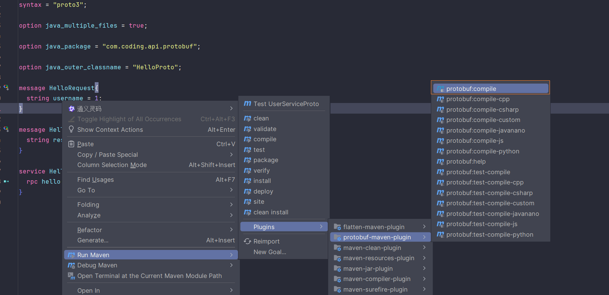
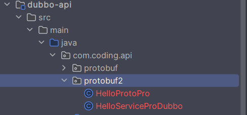

# 网络通信

## 一、简介

在上一小节之中，我们完成了第一个直连式 Dubbo 应用的开发。在这个过程之中，我们对于 Dubbo 如何进行网络通信的细节并不清楚。

**客户端通过 DubboReference 完成代理对象的注入，服务端通过 DubboService 完成服务的发布。**

里面的细节，完全被封装了。回看 RPC 通信，在一次通信过程之中，我们主要考虑如下几个方面的内容：


Dubbo 在通信过程之中，同样也离不开这些核心内容。

## 二、序列化

序列化，主要是指数据的传输格式，采用不同的序列化方式，大小也各不相同。那么在 Dubbo 之中，支持那些序列化方式呢？

https://cn.dubbo.apache.org/zh-cn/overview/mannual/java-sdk/reference-manual/serialization/serialization/

从官网的介绍之中，我们看到要在不同的协议之下，有不同的序列化方式支持。接下来，我们看一下常见的序列化方式。

### 2.1 kryo

引入依赖

```xml
<dependency>
    <groupId>org.apache.dubbo.extensions</groupId>
    <artifactId>dubbo-serialization-kryo</artifactId>
    <version>1.0.1</version>
</dependency>
```

添加配置文件

```yml
dubbo:
  application:
    name: ${spring.application.name}
  protocol:
    name: dubbo
    serialization: kryo
```

这个时候，我们再一次看一下控制台输出的信息

```markdown
Export dubbo service com.coding.api.UserService to url dubbo://192.168.1.9:20880/com.coding.api.UserService?anyhost=true&application=dubbo-provider&background=false&bind.ip=192.168.1.9&bind.port=20880&deprecated=false&dubbo=2.0.2&dynamic=true&executor-management-mode=isolation&file-cache=true&generic=false&interface=com.coding.api.UserService&ipv6=2408:8207:484d:d3a0:4865:f67c:ae63:eba7&methods=getUserNameByUserID,register&pid=2720&prefer.serialization=kryo&qos.enable=true&release=3.2.0&serialization=kryo&side=provider&timestamp=1734607575183, dubbo version: 3.2.0, current host: 192.168.1.9
```

对比一下，上一小节开发时，控制台输出的消息内容

```markdown
# 未指定序列化方式
prefer.serialization=fastjson2,hessian2
# 制定了序列化方式
prefer.serialization=kryo
serialization=kryo
```

不过当我们再次启动上一小节开发的 Consumer 的时候，但是调用过程之中是由报错的。具体的报错日志如下：


为此，我们可以通过如下方式进行关闭

```yaml
dubbo:
  application:
    name: dubbo-consumer
    qos-enable: false
```

这里，我并没有修改客户端的代码，我们先来试一试，能不能进行访问？

```java
@DubboReference(url = "dubbo://192.168.1.9:20880/com.coding.api.UserService")
private UserService userService;
```

尝试过后，可以进行访问。为此，我查阅了官方文档，对应的地址信息如下：

```markdown
https://cn.dubbo.apache.org/zh-cn/overview/mannual/java-sdk/reference-manual/serialization/serialization-upgrade/
```

文章之中，提到了，在客户端进行序列化的时候，会优先使用 prefer-serialization 配置的协议，如果不支持，才会使用 serrialization 配置的协议。按照这样的方式，在服务端，我配置了如下的方式

```java
dubbo:
  application:
    name: ${spring.application.name}
  provider:
    prefer-serialization: kryo
  protocol:
    name: dubbo
    serialization: kryo
```

但是，我并没有修改客户端的代码，我仍然是可以进行访问通信的。通过 debug ，Serialization 接口的 serialize 方法，在这种情况之下，使用的是 `Hessian2` 。接下来，我调整一下调用方式

```java
@DubboReference(url = "dubbo://192.168.1.9:20880/com.coding.api.UserService?serialization=kryo")
private UserService userService;
```

不过运行时有报错信息，通过查看官网，发现导入的依赖不全

```xml
<dependency>
    <groupId>org.apache.dubbo.extensions</groupId>
    <artifactId>dubbo-serialization-kryo</artifactId>
    <version>1.0.1</version>
</dependency>

<dependency>
    <groupId>com.esotericsoftware</groupId>
    <artifactId>kryo</artifactId>
    <version>5.4.0</version>
</dependency>
<dependency>
    <groupId>de.javakaffee</groupId>
    <artifactId>kryo-serializers</artifactId>
    <version>0.45</version>
</dependency>
```

重新引入依赖之后，Debug 进入了 `KryoSerialization2` 这个类，也进一步说明了使用了 Kryo 的序列化方式。

但是，Dubbo 是如何进行兼容的？等后续进行源码查看的时候进行具体分析吧？这里标记一下：TODO：序列化方式兼容？

### 2.2 protobuf

#### 2.2.1 依赖管理

首先在父项目之中，引入如下的依赖：

```xml
<!-- 使用 protobuf -->
<dependency>
    <groupId>com.google.protobuf</groupId>
    <artifactId>protobuf-java</artifactId>
    <version>3.22.2</version>
</dependency>
<dependency>
    <groupId>com.google.protobuf</groupId>
    <artifactId>protobuf-java-util</artifactId>
    <version>3.22.2</version>
</dependency>
<dependency>
    <groupId>org.apache.dubbo</groupId>
    <artifactId>dubbo-serialization-protobuf</artifactId>
    <version>2.7.23</version>
    <exclusions>
        <exclusion>
            <artifactId>dubbo-common</artifactId>
            <groupId>org.apache.dubbo</groupId>
        </exclusion>
        <exclusion>
            <artifactId>dubbo-serialization-api</artifactId>
            <groupId>org.apache.dubbo</groupId>
        </exclusion>
        <exclusion>
            <artifactId>protobuf-java</artifactId>
            <groupId>com.google.protobuf</groupId>
        </exclusion>
        <exclusion>
            <artifactId>protobuf-java-util</artifactId>
            <groupId>com.google.protobuf</groupId>
        </exclusion>
    </exclusions>
</dependency>
```

增加编译插件

```xml
<build>
    <extensions>
        <extension>
            <groupId>kr.motd.maven</groupId>
            <artifactId>os-maven-plugin</artifactId>
            <version>1.7.1</version>
        </extension>
    </extensions>
    <pluginManagement>
        <plugins>
            <!-- 定义 protobuf 编译插件-->
            <plugin>
                <groupId>org.xolstice.maven.plugins</groupId>
                <artifactId>protobuf-maven-plugin</artifactId>
                <version>0.6.1</version>
                <configuration>
                    <protocArtifact>
                        com.google.protobuf:protoc:3.22.2:exe:${os.detected.classifier}</protocArtifact>
                    <outputDirectory>${basedir}/src/main/java</outputDirectory>
                    <clearOutputDirectory>false</clearOutputDirectory>
                    <pluginId>Dubbo</pluginId>
                    <protocPlugins>
                        <protocPlugin>
                            <id>dubbo</id>
                            <groupId>org.apache.dubbo</groupId>
                            <artifactId>dubbo-compiler</artifactId>
                            <version>0.0.2</version>
                            <mainClass>org.apache.dubbo.gen.dubbo.Dubbo3Generator</mainClass>
                        </protocPlugin>
                    </protocPlugins>
                </configuration>

                <executions>
                    <execution>
                        <goals>
                            <goal>compile</goal>
                        </goals>
                    </execution>
                </executions>
            </plugin>
        </plugins>
    </pluginManagement>
</build>
```

#### 2.2.2 Api 模块

在 API 模块之中，引入如下的依赖：

```xml
<dependencies> 
    <dependency>
        <groupId>com.google.protobuf</groupId>
        <artifactId>protobuf-java</artifactId>
    </dependency>
    <dependency>
        <groupId>com.google.protobuf</groupId>
        <artifactId>protobuf-java-util</artifactId>
    </dependency>
    <dependency>
        <groupId>org.apache.dubbo</groupId>
        <artifactId>dubbo-serialization-protobuf</artifactId>
    </dependency>
</dependencies>
<build>
    <plugins>
        <plugin>
            <groupId>org.xolstice.maven.plugins</groupId>
            <artifactId>protobuf-maven-plugin</artifactId>
        </plugin>
    </plugins>
</build>
```

在 `src/main/proto`，建立文件夹，用来存放 proto 文件，这里提供一个示例代码：

```protobuf
syntax = "proto3";

option java_multiple_files = true;

option java_package = "com.coding.api.protobuf";

option java_outer_classname = "HelloProto";

message HelloRequest{
  string username = 1;
}

message HelloResponse{
  string result = 1;
}

service HelloService{
  rpc hello(HelloRequest) returns (HelloResponse){}
}
```

编写完成之中，进行编译



最终编译完成，生成的文件如下：


#### 2.2.3 Provider 模块

由于在 API 模块，已经已增加了 protobuf 相关的依赖，所以，这里就不用引入了，接下来，我们编写对应的代码

```java
@DubboService
@Slf4j
public class UserServiceProtobufImpl implements HelloService {
    @Override
    public HelloResponse hello(HelloRequest request) {
        String username = request.getUsername();
        log.info("hello 方法 接受到的用户名为：{}", username);
        HelloResponse.Builder responseBuilder = HelloResponse.newBuilder();
        return responseBuilder.setResult("success").build();
    }

    @Override
    public CompletableFuture<HelloResponse> helloAsync(HelloRequest request) {
        return null;
    }
}
```

#### 2.2.4 Consumer 模块

对应的 Consumer 模块的示例如下：

```java
@DubboReference(url = "dubbo://192.168.1.9:20880/com.coding.api.protobuf.HelloService?serialization=protobuf")
private HelloService helloService;

@Test
public void testHelloService() {
    HelloRequest.Builder requestBuilder = HelloRequest.newBuilder();
    requestBuilder.setUsername("coding");
    HelloResponse helloResponse = helloService.hello(requestBuilder.build());
    Assert.notNull(helloResponse, "获取用户信息失败");
    log.info("hello Service 对应的执行结果为：{}", helloResponse.getResult());
}
```

#### 2.2.5 番外篇

对于目前的 proto 编译之后的文件，文件个数太多了，可以通过如下方式进行简化

```java
syntax = "proto3";
// 将这个参数设置为 false
option java_multiple_files = false;

option java_package = "com.coding.api.protobuf2";

option java_outer_classname = "HelloProtoPro";

message HelloRequestPro {
  string username = 1;
}

message HelloResponsePro {
  string result = 1;
}

service HelloServicePro {
  rpc hello(HelloRequestPro) returns (HelloResponsePro){}
}
```

对应编译之后的文件如下：



对应的服务端代码如下：

```java
@DubboService
public class UserServiceProtobufProImpl implements HelloServiceProDubbo.IHelloServicePro {
    @Override
    public HelloProtoPro.HelloResponsePro hello(HelloProtoPro.HelloRequestPro request) {
        String username = request.getUsername();
        return HelloProtoPro.HelloResponsePro.newBuilder().setResult("success").build();
    }

    @Override
    public CompletableFuture<HelloProtoPro.HelloResponsePro> helloAsync(HelloProtoPro.HelloRequestPro request) {
        return null;
    }
}
```

对应的客户端代码如下：

```java
@DubboReference(url = "dubbo://192.168.1.9:20880/com.coding.api.protobuf2.HelloServiceProDubbo$IHelloServicePro")
private HelloServiceProDubbo.IHelloServicePro helloServicePro;
@Test
public void testHelloServicePro() {
    HelloProtoPro.HelloRequestPro.Builder requestBuilder = HelloProtoPro.HelloRequestPro.newBuilder();
    requestBuilder.setUsername("coding");
    HelloProtoPro.HelloResponsePro helloResponse = helloServicePro.hello(requestBuilder.build());
    Assert.notNull(helloResponse, "获取用户信息失败");
    log.info("hello Service 对应的执行结果为：{}", helloResponse.getResult());
}
```

## 三、协议

协议就是通信双方的约定。协议 和 序列化 对应的关系如下：


在我们发送的数据前面，增加了头信息，组成了协议，信息组装完成之中，进行序列化，这样就构成了需要进行发送的消息。所以，在 Dubbo 之中，不同的协议 和 序列化 方式，会影响待发送的数据的大小。

在 Dubbo 之中，支持的协议种类是比较多的，比如，Dubbo 协议，rest 协议，triple 协议，grpc 协议等。对于不同的协议，通信的效率其实并不相同。在 Dubbo 官网之中，提供了如下的对比图：


在之前的开发之中，我们使用的都是 Dubbo 协议。

### 3.1 Dubbo 协议

> 官网链接：https://cn.dubbo.apache.org/zh-cn/overview/mannual/java-sdk/reference-manual/protocol/dubbo/

Dubbo 协议，是 Dubbo 自己定义的私有协议，基于 TCP 层，默认的通信方式是 Netty4。采用了单一长连接 和 NIO 异步通信，适合于小数据量并发的服务调用，不适合传送大数据量的服务。


### 3.2 Trip 协议

